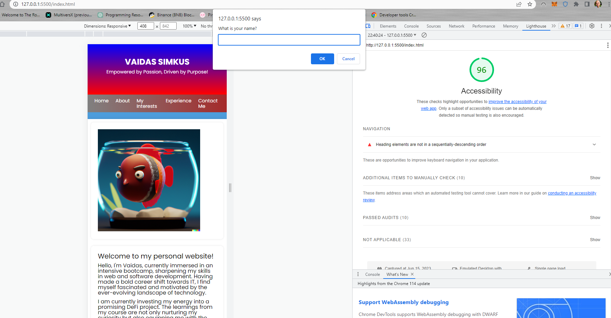

# About Me Guessing Game

This is an interactive guessing game that provides users with a set of yes/no questions about me, the site owner. It's designed to be a fun and engaging way to learn more about me.

## Updates and Changes

In the latest update of the game, we've added several new features:

- **User Personalization:** When a user starts the game, they are prompted to enter their name. This name is then used to personalize the welcome message and the final congratulatory message. This makes the user feel like they're truly interacting with the site owner.

- **Input Flexibility:** Users are now able to enter their responses as either 'y'/'n' or 'yes'/'no'. This provides a more user-friendly experience.

- **Immediate Feedback:** After each question, users are immediately alerted whether their answer was correct or incorrect. If they answered incorrectly, they are also told what the correct answer was.

- **Use of JavaScript's 'Strict Mode':** The JavaScript code for the game now runs in 'strict mode'. This feature of JavaScript helps to catch common coding mistakes and "unsafe" actions. As a result, the code for the game is more robust and less prone to bugs.

## How To Play

When you start the game, you will be prompted to enter your name. After that, you'll be asked a series of yes/no questions about me. Enter your answer to each question as either 'y'/'n' or 'yes'/'no'. After each question, you'll be told whether your answer was correct or not. At the end of the game, you'll receive a personalized congratulatory message.

## Future Updates

Stay tuned for more updates and new features in the future!

***

.